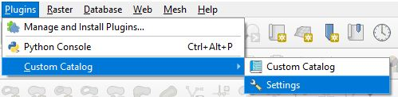

 CustomCatalog plugin

<table style="border: none;">
    <tr>
        <td align="center" style="text-align: center; vertical-align: middle;padding: 0;margin: 0;" height="20">
            
        </td>
        <td align="center" style="horizontal-align: center; vertical-align: middle;padding: 0;margin: 0;" height="20">
            
        </td>
    </tr> 
    <td style="text-align: center; vertical-align: middle;padding: 0 10px;">
        Lisez-moi
    </td>
    <td style="text-align: center; vertical-align: middle;padding: 0 10px;">
        ReadMe
    </td>
</table>

With this plugin, you can create your own layers tree based on multiple versions and multiple sources.

## How to use :
* [Configuration](#configuration)
  * [1. Create new setting](#1-create-new-setting)
  * [2. Edit catalog](#2-edit-catalog)
* [Add a layer to canvas](#add-a-layer-to-canvas)
  

## Configuration

Go to plugin `Settings`

### 1. Create new setting

* Click to `Add` button
* Define a `Name`. required !
* Choose setting `Type` : json, PostgreSQL or SQLite
  * With `json` - you can open or create a new json file. You can also define an URL but it's read-only, `Edit` button will be disabled. 
  * With `PostgreSQL` - click `connect` button and a new dialog window opens. You should select the table which contains catalogs. Select `NEW TABLE` to create a new table in database. The table name will be `catalogs`. Be careful, the setting name should exist otherwise a new record with `Name` defined in settings dialog
  * With `SQLite` - idem PostgreSQL
* Choose an `Auth Id` to connect to database (Only for PostgreSQL and SQLite). Connection dialog don't send username and password, or authentication id, when you use existing connection.

You can add or create as many setting as you want.

### 2. Edit catalog

* Select one record in settings dialog
* Click to `Edit` button.
* A new dialog opens:
  * Right-click on the catalog name to create a `node` or a `layer`
  * A `node` is a folder which contains sub-node(s) or layer(s). Double-click on the name to edit them.
  * A `layer` contains at least one version. Double-click on the name to edit them and select the geometry type (`Geom type`).
    * A `version` contains at least one format. Default name is `New version` but you can double-click to edit them. The Name column is automaticaly modified with the Version column, it's only to read easily the tree.
      * A `format` is defined by layer link. Choose a format in combobox and click to the browse button (`...`). The Name column is automaticaly modified with the Format column, it's only to read easily the tree.
        * `WFS`, `WMS`, `WMTS` : Add url with version value in Link column. Then, click on browse button (`...`). Plugin try to find layers. Select layer and the full url will be send in Link column.
        Example : `https://wxs.ign.fr/administratif/geoportail/wfs?version=2.0.0`
        * `Spatialite`, `Oracle`, `PostGIS`: You don't need to edit Link column. Click on browse button (`...`) to open connection dialog. Connection dialog don't send username and password, or authentication id, when you use existing connection. So, choose an `Auth Id` which will be saved otherwise user will have to define username and password in prompt dialog. You can also define username and password in Link column. N.B. : QGIS 3.18+ needed to open Oracle database with `createConnection` method ([commit](https://github.com/qgis/QGIS/commit/7b77243562f2c1b506143418d547ddba7392a70c)).
          * Exemple 1 : `dbname='mydb' host=db.mydomain.eu port=5432 table="myschema"."mytable" (geom)`
          * Exemple 2 : `service='myservice' table="myschema"."mytable" (geom)`
          * Exemple 3 : `dbname='mydb' host=db.mydomain.eu port=5432 user='myusername' password='mypassword' table="myschema"."mytable" (geom)`
        * `QLR`, `GPKG`, `SHP` : You don't need to edit Link column. Click on browse button (`...`) to open the OpenFileDialog. With `GPKG` format, plugin try to find layers. Select one.

## Add a layer to canvas

* Click on CustomCatalog plugin icon 
* A dock widget appears.
* Find your layer, select a version then select a format.
* Double-click on the layer name to add them to the canvas.