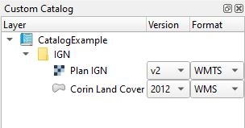

##  Plugin CustomCatalog :

<table style="border: none;">
    <tr>
        <td align="center" style="text-align: center; vertical-align: middle;padding: 0;margin: 0;" height="20">
            
        </td>
        <td align="center" style="horizontal-align: center; vertical-align: middle;padding: 0;margin: 0;" height="20">
            
        </td>
    </tr> 
    <td style="text-align: center; vertical-align: middle;padding: 0 10px;">
        Lisez-moi
    </td>
    <td style="text-align: center; vertical-align: middle;padding: 0 10px;">
        ReadMe
    </td>
</table>

Avec ce plugin, vous pouvez créer votre propre arbre de couches à partir de plusieurs versions et de plusieurs sources.

## Comment l'utiliser :
* [Configuration](#configuration)
  * [1. Créer une nouvelle configuration](#1-crer-une-nouvelle-configuration)
  * [2. Editer un catalogue](#2-editer-un-catalogue)
* [Ajouter une couche au projet](#ajouter-une-couche-au-projet)
  

## Configuration

Aller dans le menu `Configurations` du plugin

### 1. Créer une nouvelle configuration

N.B. : Une configuration peut contenir plusieurs catalogues mais au cours du développement, il semblait plus simple de n'avoir qu'un seul catalogue par configuration. Donc une configuration = un catalogue.

* Cliquer sur le bouton `Ajouter`
* Définir un `Nom`. ⚠️️ Obligatoire !
* Choisir le `Type` de configuration : json, PostgreSQL ou SQLite
  * Avec `json` - vous pouvez ouvrir ou créer un nouveau fichier. Vous pouvez également définir une URL mais la configuration sera en lecture seule, le bouton `Editer` sera désactivé. 
  * Avec `PostgreSQL` - cliquer sur le bouton `connexion` et une nouvelle fenêtre de dialogue s'ouvre. Sélectionner la table qui contient les catalogues. Sectionner `NEW TABLE` pour créer une nouvelle table dans la base de données. Le nom de la table sera `catalogs`. Attention, le nom de la configuration doit exister sinon, un nouvel enregistrement sera créé dans la table avec le `Nom` défini dans la fenêtre de gestion des configurations.
  * Avec `SQLite` - idem PostgreSQL
* Choisir un `Auth Id` pour se connecter à la base de données (Seulement pour PostgreSQL et SQLite). La fenêtre de définition de la connexion n'envoie pas le nom d'utilisateur et le mot de passe, ou l'id d'authentification, lorsque que vous choisissez d'utiliser une connexion existante.

Vous pouvez ajouter ou créer autant de configuration que vous le souhaitez.

### 2. Editer un catalogue

* Choisir un enregistrement dans la fenêtre des configurations
* Cliquer sur le bouton `Editer`.
* Une nouvelle fenêtre s'ouvre :
  * Faire un clic droit sur le nom du catalogue pour créer un `noeud` ou une `couche`.
  * Un `noeud` est un dossier qui contient des sous-dossiers ou des couches. Faire un double-clic sur le nom pour l'éditer.
  * Une `couche` contient au moins une version. Faire un double-clic sur le nom pour l'éditer et sélectionner un type de géométrie (`Geom type`).
    * Une `version` contient au moins un format. Le nom par défaut est `Nouvelle version` mais vous pouvez l'éditer par un double-clic. La colonne Nom est automatiquement modifiée avec la colonne Version, cela permet de lire plus facilement l'arbre des couches.
      * Un `format` est défini par le lien de la couche. Choisir un format dans le menu déroulant. La colonne Nom est automatiquement modifiée avec la colonne Format, cela permet de lire plus facilement l'arbre des couches.
        * `WFS`, `WMS`, `WMTS` : Ajouter une url avec la valeur de la version du service dans la colonne Lien. Puis, cliquer sur le bouton parcourir (`...`). Le plugin va essayer de trouver les couches. Choisir la couche et l'url complète sera ajouté à la colonne Lien.
        Exemple : `https://wxs.ign.fr/administratif/geoportail/wfs?version=2.0.0`
        * `Spatialite`, `Oracle`, `PostGIS`: Vous n'avez pas besoin d'éditer la colonne Lien. Cliquer sur le bouton parcourir (`...`) pour ouvrir la fenêtre de définition de la connexion. La fenêtre de définition de la connexion n'envoie pas le nom d'utilisateur et le mot de passe, ou l'id d'authentification, lorsque que vous choisissez d'utiliser une connexion existante. Choisissez donc un `Auth Id` qui sera sauvegardé sinon l'utilisateur définira manuellement le nom d'utilisateur et le mode de passe. Vous pouvez aussi définir le nom d'utilisateur et le mode de passe dans la colonne Lien. ⚠️️ QGIS 3.18+ est nécessaire pour ouvrir une base de données Oracle avec la méthode `createConnection` ([commit](https://github.com/qgis/QGIS/commit/7b77243562f2c1b506143418d547ddba7392a70c)).
          * Exemple 1 : `dbname='mydb' host=db.mydomain.eu port=5432 table="myschema"."mytable" (geom)`
          * Exemple 2 : `service='myservice' table="myschema"."mytable" (geom)`
          * Exemple 3 : `dbname='mydb' host=db.mydomain.eu port=5432 user='myusername' password='mypassword' table="myschema"."mytable" (geom)`
        * `QLR`, `GPKG`, `SHP` : Vous n'avez pas besoin d'éditer la colonne Lien. Cliquer sur le bouton parcourir (`...`) pour ouvrir la fenêtre d'ouverture de fichier. Avec le format `GPKG`, le plugin essayera de trouver les couches. Sélectionner une couche.

#### Diagramme du plugin

## Ajouter une couche au projet

* Cliquer sur l'icône du plugin CustomCatalog 
* Un nouveau widget apparait.
* Trouver votre couche, sélectionner une version puis sélectionner un format.
* Faire un double-clic sur le nom de la couche pour l'ajouter au projet.